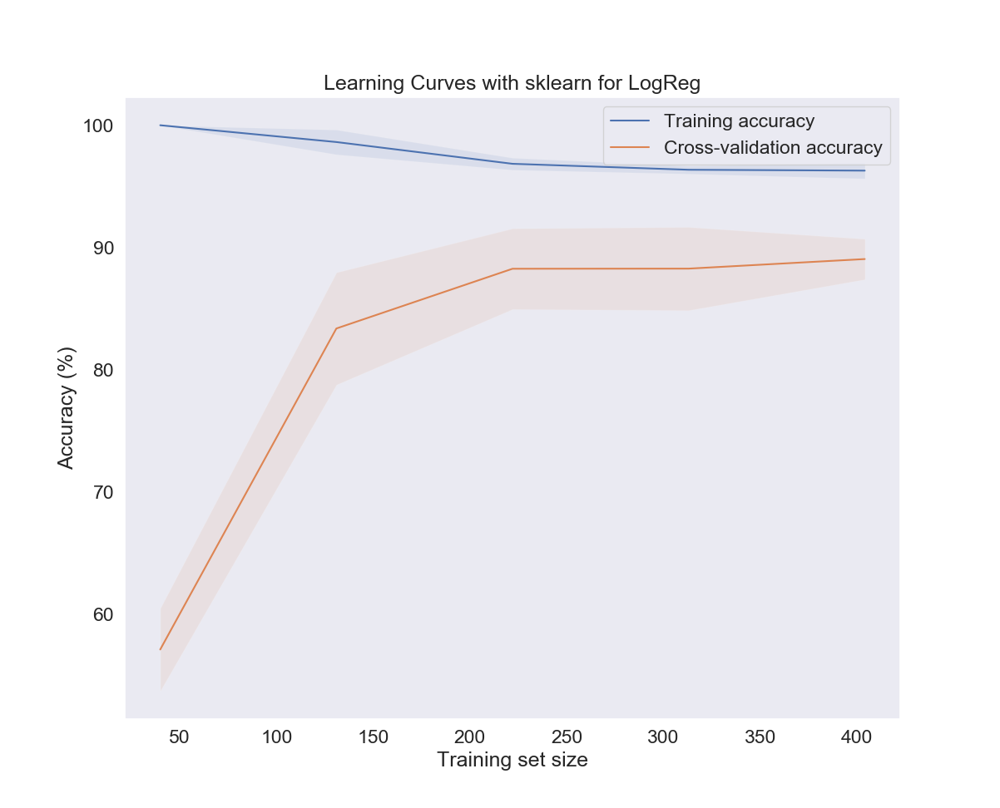
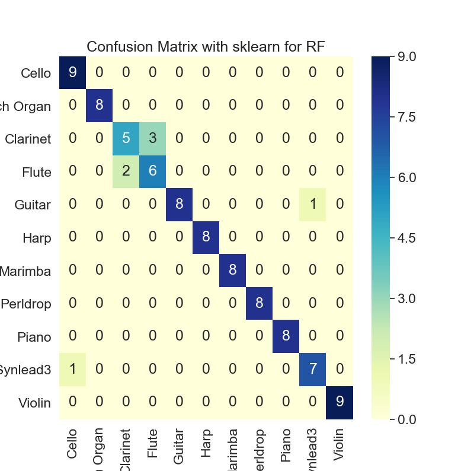
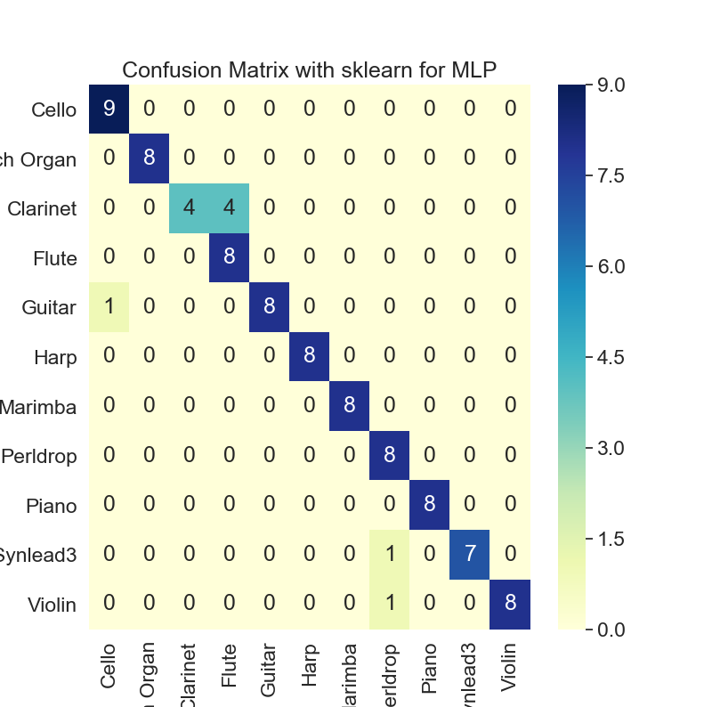

# Instrument/Timbre Classification using Machine Learning

## Introduction
Audio-based instrument classifier that identifies an instrument based on its timbre given a short sample of music. Various machine learning algorithms from the scikit-learn library were used to classify the recordings. This is a multiclass supervised learning classification.

## Technologies
* Python: 3.7.4
* Python libraries: numpy, matplotlib, pandas, seaborn, scikit-learn, librosa, soundfile

## Table of Contents
* [Background](#background)
* [Dataset](#dataset)
* [Data Preprocessing](#data-preprocessing)
* [Machine Learning Methods](#machine-learning-methods)
* [Evaluation](#evaluation)
* [Sources](#sources)

## Background
Timbre describes the unique sound quality that distinguishes the sound of instruments even with the same pitch or loudness. This is due to each instrument's unique frequency characteristics. The instruments tested were cello, church organ, clarinet, flute, guitar, harp, marimba, pinao, violin, and synthetic effects (PerlDrop and SynLead3).

## Dataset
An electronic keyboard that emulated various instruments was used to record music samples from various genres.

See the Recordings folder for the recordings in .wav files.

## Data Preprocessing
### Data cleaning
The recordings were converted from stereo to mono and resampled to 16kHz to reduce file size. Silent beginning and ending periods of each sample were removed. Each sample was split into 2 second blocks with a 1 second step size between the blocks.

See the samples folder created from the create_samples.py file.\
To make reading the data in easier, data.csv was created from create_data_file.py.

### Feature Extraction
Mel-frequency cepstral coefficients (MFCCs) were used as the features. They are commonly used in speech recognition and in music information retrieval.
To extract the MFCCs, each sample recording was split into small frames or windows. For each frame, a designated number of coefficients were computed which in this case was 12. Then the MFCCs were averaged over the total number of windows to reduce the dimensionality of the dataset. 

Two types of datasets were investigated. The first feature dataset (dataset 0) contained the 12 averaged MFCC's while the second feature dataset (dataset 1) contained the 12 averaged MFCC's and their respective variance for a total of 24 features.

See feature_extraction.py and the csv folder for the datasets.

## Machine Learning Methods
The following 11 machine learning algorithms were selected to classify the recordings: 
 * Ridge classification
 * Logistic regression
 * Linear discriminant analysis (LDA)
 * Gaussian naive bayes
 * Support vector machine (SVM)
 * Multi-layer perceptron (MLP)
 * Decision trees (DT)
 * k-nearest neighbors (kNN)
 * Random forest (RF)
 * Gradient boosting (GB)
 * AdaBoost (AB)
 
 See learning.py for training the models

## Evaluation 
Evalution metrics used were:
 * Test accuracy
 * Precision
 * Recall
 * F-score
 * Learning curves
 * Confusion matrices
 * ROC curves/ AUC 
 
 See learning.py for test accuracies, precision, recall, and F-scores.\
 See images folder for learning curves, confusion matrices, and ROC curves/AUC.

Based on test accuracy, the top performing models were SVM, MLP, and kNN with over 90% accuracy. The 2nd feature set including the mean MFCC's + variance seemed to improve the performance of the majority of the models with logistic regression, LDA, SVM, MLP, kNN, and RF all having over 90% accuracy. This improvement could have been due to more features lowering the bias.

Most of the learning curves indicated that with a greater training set size, the cross-validation accuracy improved while the training accuracy decreased. For some models, the training accuracy was very high despite lower cross-validation accuracies most likely due to overfitting the training set. Additionally, some of the test accuracies were steadily increasing so adding more training instances might improve those models.

The confusion matrices, similar to test accuracies, indicated that SVM, MLP, kNN, LDA, and RF performed well. They also highlighted that clarinet and flute were the most difficult to classify from each other which makes sense as they both come from the woodwind family. Interestingly, the cello and violin which both come from the strings family were able to be distinguished on average with most of the models correctly identifying the cello recordings.

In the images below where the models had high test accuracies, it shows the misclassification between clairnet and flute while cello and violin were correctly identified.

The AUC from the ROC curves showed an improvement from the first feature set (feature set 0) to the second feature set (feature set 1) for all the models since the AUC increased. The decision tree model had the worst AUC score. 

## Sources
Feature extraction based on:
https://musicinformationretrieval.com/genre_recognition.html?fbclid=IwAR0QnFEJi2pXzll7unDKQR9GS5RtnJelA42d9ijcax-2Wx6n_LYpLj58r1M
